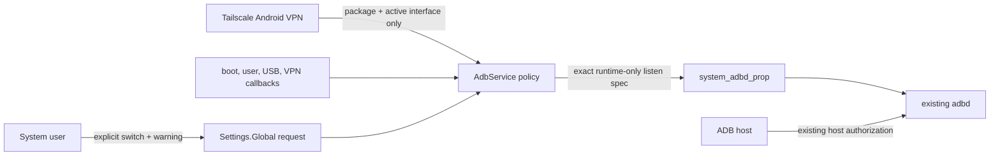

# Tailscadble threat model

## Overview

Tailscadble is a system-image integration, not a network service of its own.
Settings records one system-user request in `Settings.Global`. `AdbService` is the
sole policy owner: it validates Android lifecycle state and the active Tailscale VPN,
writes a non-persistent exact-address listener property, then asks init to
restart/stop the existing `adbd`. Native `adbd` binds that numeric address while
retaining its normal host-key authorization path.

| Component | Privilege or asset | Enforcing control | Source evidence |
| --- | --- | --- | --- |
| Settings controller | Owner intent | system user, Developer Options, confirmation, default `0` | `patches/0003-settings-tailscadble.patch` |
| `AdbService` | Listener lifecycle | boot/USB/current-user/observer/VPN/interface predicate | `patches/0002-frameworks-base-tailscadble.patch` |
| VPN service | Tailscale identity | active `VpnConfig.user`, matching live interface, CGNAT prefix | `patches/0002-frameworks-base-tailscadble.patch` |
| SELinux property service | Listener destination | `system_adbd_prop`; only init/system_server may set | `patches/0004-sepolicy-listen-property.patch` |
| `adbd` | Debug shell authority | unchanged ADB host authorization; exact numeric bind; no mDNS | `patches/0001-adb-specific-listener.patch` |

## Assets and trust boundaries

Protected assets are the Android debug shell, approved ADB host keys, the owner's
enablement intent, device/tailnet addressing privacy, Tailscale session isolation,
and release-signing integrity.

Realistic attackers:

- a tailnet peer that has network reachability but no approved ADB host key;
- a LAN, carrier, or public-internet host outside the active Tailscale VPN path;
- a secondary Android user trying to inherit or enable a device-wide listener;
- another VPN app replacing Tailscale;
- an unprivileged app trying to set the listener property;
- a reader of logs or public release artifacts looking for addresses or keys.

Excluded starting powers: root, system-server code execution, control of the ROM
signing pipeline, control of an already-approved ADB host, and control of the
installed Tailscale package. Those powers already cross the protected boundary.

Security objectives:

1. Missing setting means OFF; no persistent listener property exists.
2. Only the Android system user can request ON, after an explicit warning.
3. Listener activation requires boot completion, USB debugging, registered lifecycle
   observers, the current system user, active Tailscale VPN package identity, a live
   matching interface, and an IPv4 address inside `100.64.0.0/10`.
4. OFF, USB disable, user switch, ADB authorization clear, VPN/interface loss, VPN
   replacement, or observer setup failure clears the property and restarts/stops
   `adbd`; a property-clear error takes the stop-only fallback.
5. `0.0.0.0`, carrier/Wi-Fi addresses, mDNS advertisement, and ADB-auth bypass are
   never introduced.
6. Runtime addresses, tailnet names, credentials, pairing codes, host keys, and
   release/platform/AVB keys are not logged, displayed, persisted to disk, or
   exported. The exact address exists only in the active runtime property.

## State machine

| State | Request | Preconditions | Listener |
| --- | --- | --- | --- |
| `OFF` | `0` or absent | any | empty |
| `ARMED` | `1` | one or more runtime predicates false | empty |
| `ACTIVE` | `1` | every predicate true | exact Tailscale IPv4 only |
| `FAIL_CLOSED` | any | observer setup/query/property error | property cleared and `adbd` restarted, or stop-only fallback; owner action required |

| Event | Transition and invariant |
| --- | --- |
| Stock boot / pre-boot | `OFF`; request and runtime property are cleared during service construction |
| Explicit system-user ON | `ACTIVE` only if every predicate is true; otherwise `ARMED` |
| Toggle OFF / Developer Options OFF | `OFF`; clear property before adbd restart/stop |
| USB debugging OFF | request cleared, then `OFF` |
| Tailscale down/logout/interface loss | `ARMED`; exact listener removed |
| VPN replaced | `ARMED`; package/interface mismatch removes listener |
| Android user switch | request cleared, then `OFF` |
| Revoke ADB authorizations | request cleared, listener closed, host keys cleared |
| Wi-Fi to cellular or cellular to Wi-Fi | remain `ACTIVE` only if the same validated VPN interface/address remains live |
| Reboot / `system_server` reconstruction | request and property clear; explicit owner ON is required again |
| adbd restart | reads only the current non-persistent exact-address property |
| Device lock / Doze | no policy transition; existing ADB authorization semantics remain, while VPN loss still triggers fail-closed handling |

## Prioritized attacker stories

| Priority | Scenario and capability gain | Existing controls | Residual validation |
| --- | --- | --- | --- |
| High hypothesis | Listener accidentally reaches LAN/carrier/public internet, granting an approved key a new path | exact active-VPN address bind, package+interface check, no wildcard, no mDNS | core exact-address/no-wildcard socket test passed; repeat route probes on the exact export |
| High hypothesis | VPN/user transition leaves a stale listener | callbacks, current-user predicate, user-switch reset, non-persistent property, adbd restart | core OFF/ON lifecycle passed; test the export-only user/error resets, Doze, and process restarts |
| High hypothesis | Unapproved tailnet peer gains shell | unchanged adbd authorization and clear-key path | fresh unapproved host must remain unauthorized |
| Medium hypothesis | Address or key material leaks through logs/export | redacted Java/native logs, no address in UI, secret scan | inspect release logs and archive |
| Medium hypothesis | A non-Tailscale CGNAT interface is mistaken for Tailscale | require both `VpnConfig.user` and matching live VPN interface | competing VPN/CGNAT device test |
| Low hypothesis | External caller gains new VPN-config access | `enforceCallingOrSelfPermission` permits system-server self calls but retains external `CONTROL_VPN` check | platform permission tests |

These are threat scenarios, not claims of exploitable vulnerabilities. Physical-device
acceptance proved the predecessor's core exact-listener, OFF/ON, cellular Tailscale ADB,
USB ADB, and normal-runtime path. Host review then found five concrete defects across
the pre-export implementation and first candidate—address disclosure, post-switch
shutdown, callback/Settings-observer failure bypasses, and stale listeners after
property/restart errors—and the export patches address them. Device-only behavior of
those later hardening deltas remains unproven.

## Severity calibration

- **Critical:** unauthenticated public remote code execution or a deliberate ADB
  authorization bypass. No such path is intended or established here.
- **High:** reproducible exposure outside the Tailscale interface, or a lifecycle
  race that leaves shell access reachable after explicit OFF/revoke.
- **Medium:** address/key disclosure without shell compromise, or a constrained
  same-device privilege boundary failure.
- **Low:** diagnostic or availability defects with no new authority.

Core functional confidence is backed by the completed signed-build physical-device
acceptance. Confidence in the later export-only hardening remains limited until the
focused matrix passes on an exact signed build; host checks cannot prove Android
broadcast timing, VPN revoke timing, Doze, user switching, or init/adbd failure paths.
